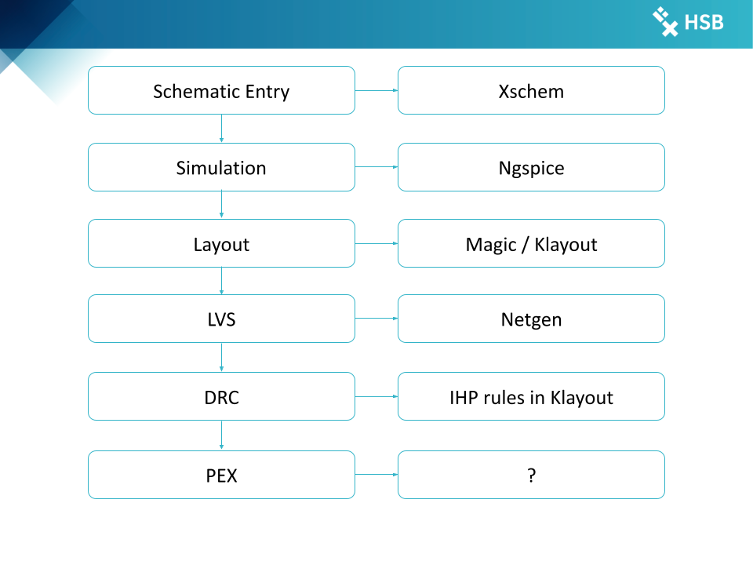

# Phase 1: System Defination

## Defining Specs{#sec-def-specs}

## Choosing Topology

Based on the specifications from @sec-def-specs and the analysis in @wicht2020, we selected the **voltage-mode buck converter topology** due to its efficiency, control simplicity, and suitability for step-down applications. Our LED driver IC must regulate an output voltage of around 3.3–5 V from a higher input range of 18–36 V, which aligns perfectly with the buck converter’s role as a step-down regulator. Additionally, Wicht emphasizes the advantages of voltage-mode control with analog building blocks such as error amplifiers, ramp generators, and comparators—components that are well-suited for integration using the IHP SG13G2 analog process. The buck topology also enables high switching frequencies (1–5 MHz), reducing passive component size and allowing better thermal management, which is critical given the 667 mW thermal power limit of the IC package.

| Block                                          | Function                                               |
|------------------------------------------------|--------------------------------------------------------|
| Power Stage Interface                          | Inductor-Capacitor Buck output stage                   |
| PWM Generator                                  | Ramp + Comparator                                      |
| Error Amplifier                                | Feedback loop, V_ref vs V_out                          |
| Current Control                                | Per channel analog regulation (DAC + current sink)     |
| Thermal + Voltage protections                  | Shutdown to over-temperature, over and under voltages  |
| Biasing, reference circuits, reference sources | Bandgap or bias current                                |

## Block Diagram 

{#fig-block-diagram}

# Phase 2: Analog Design

| Block                                          | Topology                                               | Target                             |
|------------------------------------------------|--------------------------------------------------------|------------------------------------|
| Error Amplifier                                | Folded Cascode                                         | High gain, wide swing              |
| Ramp generator                                 | Linear Ramp with I_source + C                          | 1 MHz to 5 MHz                     |
| Comparator                                     | Fast, Low offset                                       | Optimized slew and delay           |
| Current sink                                   | DAC input + current mirror                             | Adjustable: 1 mA to 40 mA          |
| Thermal + Voltage protections                  | Window comparator, bias logic                          | shutdown above 105°C, < 18V, > 36V |

# Phase 3: 

{#fig-design-flow}

# Order of Design

{#fig-order-of-design}
